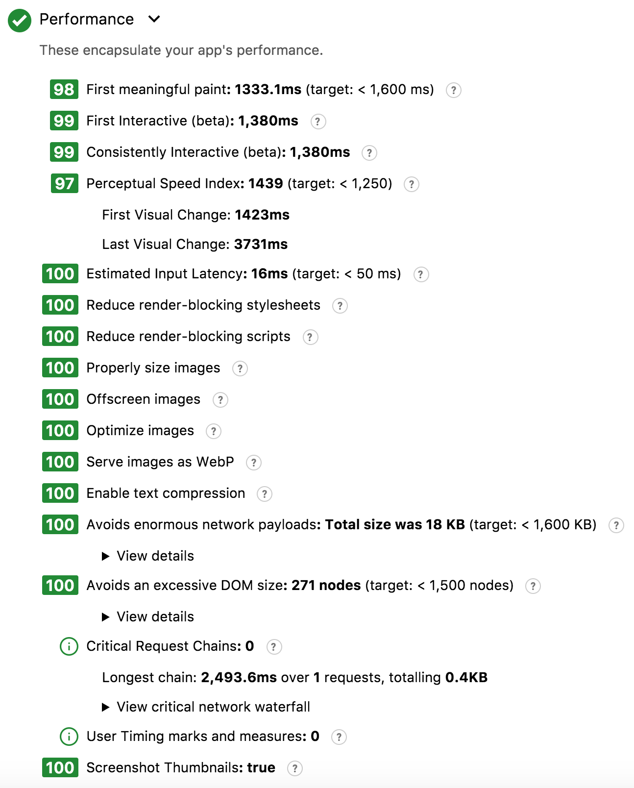

# WebComponents Hacker News Example

This is an example of a PWA built using pure WebComponents.

It is not intended to be any kind of definitive blueprint for building applications, just an example
to demonstrate that it is possible to build a modern, fast, Progressive Web App without depending on
a framework - because WebComponents are like having a framework that is built in to the browser.

## Work In Progress

The implementation isn't complete yet but you can [view the preview version here](https://hn-dot-captain-codeman.appspot.com/).

Main things to complete are:

* Add story item view with comments
* Add service-worker and data caching
* Automate the build (esp. the hashed JS file ref)
* Optimize list rendering to reduce reflow / repaint
* Use a single source for views / templates
* Cross-browser compatibility & testing (only Chrome + Safari + FireFox)
* Lots of tidy up!

## Server Side Rendering

First-view performance is boosted by Server Side Rendering (SSR) of the requested view using Go.

## Lighthouse Score

Initial testing using WebPageTest.org's Lighthouse option shows decent performance for the fast 3G
profile as used by the [hnpwa.com](hnpwa.com) site with the First Interactive time of 1.38s

